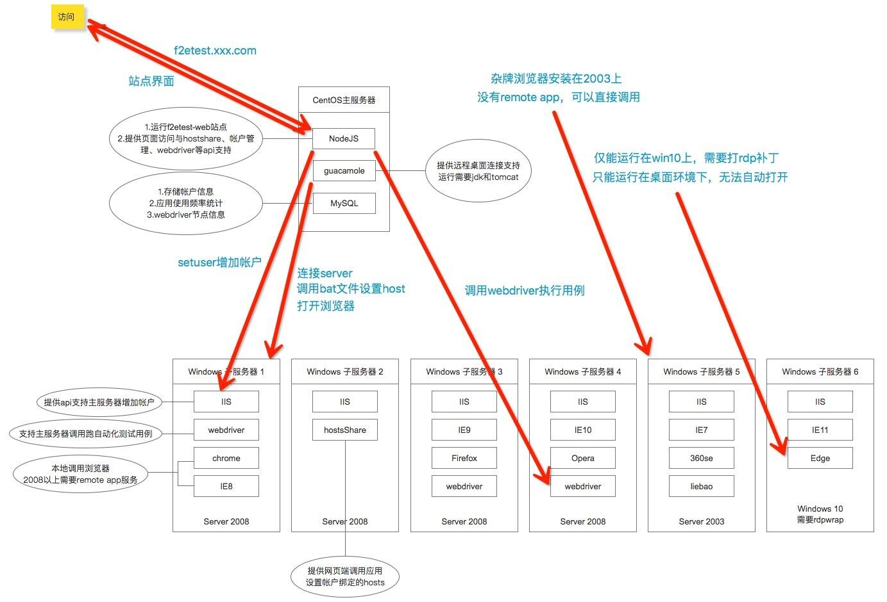

F2etest
===================

F2etest是一个面向前端、测试、产品等岗位的多浏览器兼容性测试整体解决方案。

注：F2e test = Front to End Test = 前端测试

浏览器云
=================================

在之前，多浏览器兼容性人肉测试，我们一般有三种解决方案：

1. 本机安装大量的虚拟机，一个浏览器一个虚拟机，优点：真实，缺点：消耗硬盘资源，消耗CPU资源，打开慢，无法同时打开多个虚拟机
2. 使用IeTester等模拟软件，优点：体积小，资源消耗小，缺点：不真实，很多特性不能代表真实浏览器
3. 公用机器提供多种浏览器，优点：不需要本地安装，不消耗本机资源，缺点：资源利用率低，整体资源消耗非常恐怖

现在，有了F2etest，一台普通的4核CPU的服务器，我们就可以提供给20人以上同时使用。

在这之前我们需要20台机器，相比之下，至少10倍的硬件利用率提升。

再加上我们平时做多浏览器测试时，并不是满负荷工作。经常是测试一会，开发一会，或者是忙点别的事，因此理论并发能力至少可以再乘2，就是说一台4核服务器，理论上跑40人同时在线，非常轻松。

但是在此之前，如果我们是单人虚拟机模式的话，当你没在测试时，CPU、内存、硬盘，全部都是处在浪费状态。

相比之前的方案，我们有以下优势：

1. 10倍以上硬件利用率，降低企业运营成本
2. 非常棒的用户体验，极大的提高测试效率
3. 真实浏览器环境，还原真实测试场景

在这个解决方案中，我们使用了以下技术：

1. Guacamole: 开源的HTML5远程解决方案
2. Windows Server: Server版Windows，最大化复用机器资源
3. hostsShare: 跨浏览器，跨服务器的hosts共享

具体如何配置，F2etest-Web中可以看到详细的教程，并且我们提供了完整的配置文件下载。

工作流程图如下：

成功案例
=================================

如果您使用了我们的解决方案，请联系我们添加在此处。

产品截图
=================================

浏览器云
-------------------

Chrome插件:

由于本系统基于Windows Server体系搭建，因此系统的安全性完全取决于部署人的安全部署能力。

如果您希望部署本系统，请确保以下几点：

1. 严禁将本系统部署在公网环境，仅可部署在内网环境中使用，作为内部测试用途
2. 请将Windows Server服务端升级到最新版本及补丁，以保证没有出现安全漏洞
3. 请将User用户之间做到完全隔离，仅提供User用户文件的访问权限，别的任何权限请勿多余授权
4. 请将f2etest-client仅设置为管理员拥有权限，防止API接口被恶意访问

安装教程
===================

安装请前往安装教程页面： 

1. [linux安装](https://github.com/midday/f2etest-environment-configuration/install/linux-install.md) 
2. [windows-server-2003安装](https://github.com/midday/f2etest-environment-configuration/install/windows-server-2003-install.md) 
3. [windows-server-2008安装](https://github.com/midday/f2etest-environment-configuration/install/windows-server-2008-install.md) 

第3方安装及使用教程：

1. [http://shaofan.org/f2etest/](http://shaofan.org/f2etest/)
2. [http://shaofan.org/ui-recorder/](http://shaofan.org/ui-recorder/)

各机器服务器配置文件示例参考
===================

请查看文件夹：all-server-config-file

问题&总结请前往：[问题&总结](https://github.com/midday/f2etest-environment-configuration/install/Q&A.md)

感谢
===================

* Guacamole: [http://guac-dev.org/](http://guac-dev.org/)
* Nodejs: [http://nodejs.org/](http://nodejs.org/)
* async: [https://github.com/caolan/async](https://github.com/caolan/async)
* ejs: [https://github.com/mde/ejs](https://github.com/mde/ejs)
* express: [https://github.com/expressjs/express](https://github.com/expressjs/express)
* jwebdriver: [https://github.com/yaniswang/jWebDriver](https://github.com/yaniswang/jWebDriver)
* mysql: [https://github.com/felixge/node-mysql](https://github.com/felixge/node-mysql)
* request: [https://github.com/request/request](https://github.com/request/request)

