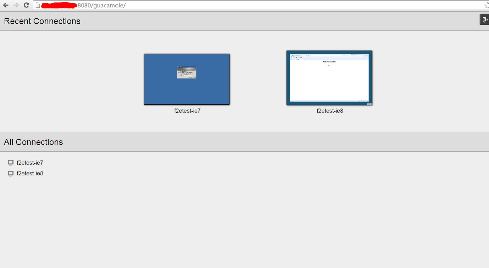

Linux 安装步骤
===================
1. 下载f2etest代码

        git clone https://github.com/alibaba/f2etest.git

    clone后，会发现以下几个目录：

    1. `f2etest-web`: f2etest的WEB站点，用来提供f2etest服务，用户最终就是访问这个站点使用f2etest
    2. `f2etest-guacamole`: 这是我们定制过的开源版本，方便f2etest进行调用
    3. `f2etest-client`: f2etest的执行机客户端站点，主要提供API给f2etest-web使用，用来同步用户账号
    4. `hostsShare-client`: 安装在f2etest远程环境中的客户端，用来修改f2etest-web上的hosts绑定
    5. `f2etest-local`: 用来在本机安装代理服务器，并将f2etest所有访问反向代理到本地，以共享本机的hosts绑定，本组件已发布至npm，无需安装，详细使用请至系统内查看帮助
    6. `f2etest-chrome`: chrome浏览器下的客户端，无需打开f2etest网站，即可访问f2etest中的所有APP，本组件已发布至chrome官方市场，无需安装，详细使用请至系统内查看帮助

    我们建议将1，2组件安装在同一台Linux服务器上，操作系统为CentOs。

2. 安装nodejs(以node-4.2.2为例)
    (1)安装gcc和gcc-c++(编译node时使用，如果没有，请安装)
    ```bash
        yum install -y gcc gcc-c++
    ```
    (2)下载node安装包(如果没有网络，可手动下载)
    ```
        wget https://nodejs.org/dist/v4.2.1/node-v4.2.1.tar.gz
    ```
    (3)解压node并进入node目录
    ```bash
        tar -zxvf node-v4.2.1.tar.gz
        cd node-v4.2.1
    ```
    (4)生成makefile文件
    ```bash
        ./configure
    ```
    (5)编译安装
    ```bash
        make&&make install
    ```
    (6)验证版本
    ```bash
        node --version
    ```
2. 安装 Java
    下载：
    ```bash
        mkdir /usr/java
        cd /usr/java
        wget http://download.oracle.com/otn-pub/java/jdk/7u79-b15/jdk-7u79-linux-x64.tar.gz?AuthParam=1440926059_deb5f2aa485976bed6105e9a5b2fbf42
        tar -zxvf jdk-7u75-linux-x64.gz
        vi /etc/profile
    ```
    编辑配置文件
    ```
        JAVA_HOME=/usr/java/jdk1.7.0_75
        CLASSPATH=.:$JAVA_HOME/lib.tools.jar
        PATH=$JAVA_HOME/bin:$PATH
        export JAVA_HOME CLASSPATH PATH
    ```
    ```bash
        source /etc/profile
        java -version
    ```
3. 安装 tomcat7
    下载：[http://tomcat.apache.org/download-70.cgi](http://tomcat.apache.org/download-70.cgi)
    ```bash
        cd /usr/local/
        wget http://mirrors.hust.edu.cn/apache/tomcat/tomcat-7/v7.0.64/bin/apache-tomcat-7.0.64.tar.gz
        tar -xzvf apache-tomcat-7.0.64.tar.gz
        mv apache-tomcat-7.0.64 tomcat7
        cd /etc/init.d
        vi tomcat7
    ```
    编辑配置文件
    ```
        #!/bin/bash
        # description: Tomcat Start Stop Restart
        # processname: tomcat
        # chkconfig: 234 20 80
        JAVA_HOME=/usr/java/jdk1.7.0_75
        export JAVA_HOME
        PATH=$JAVA_HOME/bin:$PATH
        export PATH
        CATALINA_HOME=/usr/local/tomcat7

        case $1 in
        start)
        sh $CATALINA_HOME/bin/startup.sh
        ;; 
        stop)   
        sh $CATALINA_HOME/bin/shutdown.sh
        ;; 
        restart)
        sh $CATALINA_HOME/bin/shutdown.sh
        sh $CATALINA_HOME/bin/startup.sh
        ;; 
        esac    
        exit 0
    ```
    ```bash
        chmod 755 tomcat7
        chkconfig --add tomcat7
        chkconfig --level 234 tomcat7 on
        chkconfig --list tomcat7
        service tomcat7 start
    ```
4. 安装 guacamole-server
    ```bash
        yum install cairo-devel libpng-devel uuid-devel freerdp* libvncserver-devel openssl-devel
        ln -s /usr/local/lib/freerdp/guacsnd.so /usr/lib64/freerdp/
        ln -s /usr/local/lib/freerdp/guacdr.so /usr/lib64/freerdp/
        mkdir -p /home/guacdshare
        chmod 777 /home/guacdshare
        tar -xzf guacamole-server-0.9.3.tar.gz
        cd guacamole-server-0.9.3
        ./configure --with-init-dir=/etc/init.d
        make
        make install
        ldconfig
        chkconfig --add guacd
        chkconfig guacd on
        chkconfig --list guacd
        service guacd start
        netstat -panl | grep guacd
    ```
5、安装 guacamole-client
    ```bash
        cp guacamole-0.9.3.war /usr/local/tomcat7/webapps/guacamole.war
        mkdir /etc/guacamole
        mkdir /root/.guacamole
        vi /etc/guacamole/guacamole.properties
    ```
    编辑配置文件
    ```
        # Hostname and port of guacamole proxy
        guacd-hostname: localhost
        guacd-port:     4822
        enable-websocket: true
        enable-clipboard-integration: true

        auth-provider: net.sourceforge.guacamole.net.auth.noauth.NoAuthenticationProvider
        noauth-config: /etc/guacamole/noauth-config.xml

        # auth-provider: net.sourceforge.guacamole.net.basic.BasicFileAuthenticationProvider
        # basic-user-mapping: /etc/guacamole/user-mapping.xml
    ```
    ```bash
        ln -s /etc/guacamole/guacamole.properties /root/.guacamole
        vi /etc/guacamole/noauth-config.xml
    ```
    编辑配置文件
    ```bash
        <configs>
            <config name="f2etest-ie6" protocol="rdp">
                <param name="hostname" value="xxx.xxx.xxx.xxx" />
                <param name="port" value="3389" />
                <param name="enable-drive" value="true" />
                <param name="drive-path" value="/home/guacdshare" />
            </config>
            <config name="f2etest-ie7" protocol="rdp">
                <param name="hostname" value="xxx.xxx.xxx.xxx" />
                <param name="port" value="3389" />
                <param name="enable-drive" value="true" />
                <param name="drive-path" value="/home/guacdshare" />
            </config>
            <config name="f2etest-ie8" protocol="rdp">
                <param name="hostname" value="10.126.60.142" />
                <param name="port" value="3389" />
                <param name="enable-drive" value="true" />
                <param name="drive-path" value="/home/guacdshare" />
            </config>
            <config name="f2etest-ie9" protocol="rdp">
                <param name="hostname" value="10.126.60.143" />
                <param name="port" value="3389" />
                <param name="enable-drive" value="true" />
                <param name="drive-path" value="/home/guacdshare" />
            </config>
            <config name="f2etest-ie10" protocol="rdp">
                <param name="hostname" value="10.126.60.144" />
                <param name="port" value="3389" />
                <param name="enable-drive" value="true" />
                <param name="drive-path" value="/home/guacdshare" />
            </config>
            <config name="f2etest-ie11" protocol="rdp">
                <param name="hostname" value="10.126.60.145" />
                <param name="port" value="3389" />
                <param name="enable-drive" value="true" />
                <param name="drive-path" value="/home/guacdshare" />
            </config>
        </configs>
    ```
    ```bash
        service tomcat7 restart
    ```
6. 验证guacamole部署成功   
    访问如下地址[http://tomcatserver:8080/guacamole](http://tomcatserver:8080/guacamole)，你应该看到如下界面，否则部署没成功
    
7. 安装mysql(以mysql-5.6.33为例)  
    到mysql官网下载mysql编译好的二进制安装包，在下载页面Select Platform:选项选择linux-generic，然后把页面拉到底部，64位系统下载Linux - Generic (glibc 2.5) (x86, 64-bit)    
    - 解压安装包
    ```bash
        tar -zxvf mysql-5.6.33-linux-glibc2.5-x86_64.tar.gz
    ```

    - 复制解压后的mysql目录到系统的本地软件目录
    ```bash
        cp mysql-5.6.33-linux-glibc2.5-x86_64 /usr/local/mysql -r
    ```
    - 添加系统mysql组和mysql用户
    ```bash
        groupadd mysql
        useradd -r -g mysql mysql
    ```
    - 进入mysql软件目录并将当前目录拥有者修改为mysql用户
    ```bash
        cd /usr/local/mysql
        chown -R mysql:mysql ./
    ```
    - 安装数据库
    ```bash
        ./scripts/mysql_install_db --user=mysql
    ```
    - 修改当前目录拥有者为root用户
    ```bash
        chown -R root:root ./
    ```
    - 修改当前data目录拥有者为mysql用户
    ```bash
        chown -R mysql:mysql data
    ```
    - 添加开机启动mysql服务并启动mysql服务
    ```bash
        cp support-files/mysql.server /etc/init.d/mysql
        service mysql start
    ```
    - 把mysql客户端放到默认路径
    ```bash
        ln -s /usr/local/mysql/bin/mysql /usr/local/bin/mysql
    ```
    - 如有必要，可修改mysql密码
    ```bash
        service mysql stop
        mysqld_safe --user=mysql --skip-grant-tables --skip-networking &
        mysql -u root mysql
        UPDATE user SET Password=PASSWORD('newpassword') where USER='root';
        FLUSH PRIVILEGES;
        quit;
        service mysql restart
        mysql -uroot -p
    ```
8. 创建数据库并初始化表  
    - 新建库：f2etest  
    - 初始化表结构：f2etest-web/f2etest.sql  
9. 配置f2etest-web    
    - 初始化f2etest-web  
    ```bash
        cd f2etest-web
        npm install
    ```
    - 修改conf/site.json
    ```bash
        port: 站点监听端口号
        name: 站点名称，修改为自己站点名称
        about: 站点介绍，显示在网页title后面，修改为自己的站点介绍
        icon: 站点icon，默认不需要修改
        dbHost: 数据库连接信息，修改为mysql服务器IP地址
        dbUser: 同上
        dbPass: 同上
        dbTable: 同上
        clientApiKey: f2etest远程桌面客户端的ApiKey，正确的ApiKey才能访问远程的API，用来创建当前用户的账号，请更改为随机值，并保持和f2etest-client中的值一致
        guacamoleApi: guacamole的API，f2etest-link.xxxx.com是tomcat地址xxxx.xxxx.xxxx.xxxx:8080
        footer: 根据需要修改
        statNav: 如果需要自行扩展统计页面，根据需要修改
    ```
    - 修改conf/server.json
    ```bash
        这里的id必需要与f2etest-guacamole中的名字保持一致
        2003系统不支持remoteApp，2008以上Server系统支持
    ```
    - 修改conf/app.json
    ```bash
        这里的server必需为server.json中已配置的id。program为可选参数，如果不填则直接连接桌面。
    ```
    - 启动f2etest-web服务：
    ```bash
        node app.js
    ```
    - 启动成功后，可以发现WEB服务默认工作在：3000端口号
    - 小建议：
    ```bash
    为了方便用户使用，建议安装nginx等软件做反向代理，将80端口反向到3000端口，以将3000端口号隐藏起来。
    建议使用pm2组件实现系统开机自动运行。
    安装快捷方式到Windows桌面 (Win7)功能，需要让f2etest-web支持HTTPS协议，否则此功能无法正常使用
    ```
10. nginx 配置如下  

        location / {
            proxy_pass       http://127.0.0.1:3000;
            proxy_set_header Host      $host;
            proxy_set_header X-Real-IP $remote_addr;
            proxy_set_header X-Forwarded-For $proxy_add_x_forwarded_for;
            proxy_buffering off;
        }


